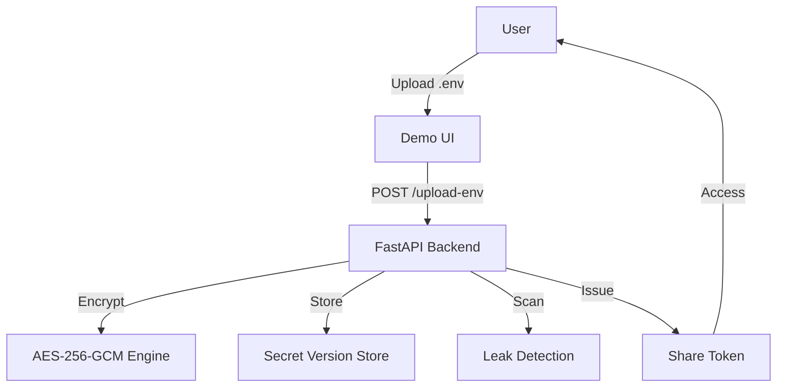

# SafeGuard Env

[](https://github.com/bhaveshdamani5-crypto/SAFEGUARD-ENV) [](https://huggingface.co/spaces/bhavesh657/SafeGuard-Env)

## Secure `.env` management for modern teams

SafeGuard Env prevents dangerous `.env` leaks by encrypting secrets on ingest, enforcing role-based access, and providing safe share tokens for audits and demo-ready workflows.

### Problem

Environment variables are often stored in plain text, accidentally checked into GitHub, or shared insecurely across teams. This creates high-risk leaks for API keys, database credentials, and cloud secrets.

### Solution

A lightweight secure vault that:

- encrypts `.env` secrets with AES-256-GCM,
- stores only masked previews,
- tracks secret versions,
- issues scoped share tokens,
- and detects GitHub-style leak patterns.

---

## How it works

1. Upload a `.env` file or paste variables into the demo UI.
2. Each secret is encrypted immediately with AES-256-GCM.
3. Encrypted payloads are stored in-memory with version metadata.
4. A leak scanner marks suspicious tokens and `.env` exposure risk.
5. Admin users can create tokens for secure access without revealing plaintext by default.

---

## Architecture

- `frontend/` — UI concept and future dashboard placeholder
- `backend/` — FastAPI API for secret ingest, sharing, and scanning
- `encryption/` — AES-256-GCM cryptography implementation
- `demo/` — Gradio sample app for Hugging Face Spaces
- `docs/` — architecture, security, and feature documentation



---

## Features

- AES-256-GCM secret encryption
- Secure `.env` ingestion and parsing
- Secret versioning and audit metadata
- Role-based access: `admin`, `editor`, `viewer`
- Token-based secure sharing
- Basic GitHub leak detection patterns
- Risk scoring: `low`, `medium`, `high`
- Masked secret preview UI
- Demo-ready Hugging Face Space

---

## Tech stack

- Python 3.10+
- FastAPI
- Gradio
- cryptography
- Pydantic
- Hugging Face

---

## Screenshots


> Screenshot placeholders — replace with actual UI captures after frontend polish.

---

## Demo

### Local demo

```bash
python -m venv .venv
# Windows PowerShell
.venv\Scripts\Activate.ps1
# macOS/Linux
source .venv/bin/activate
pip install -r requirements.txt
python app.py
```

Visit `http://localhost:7860`

### Hugging Face Spaces

Set `HF_TOKEN` and deploy:

```bash
set HF_TOKEN=hf_...
set HF_SPACE_NAME=SafeGuard-Env
python deploy_to_hf.py
```

---

## Why this is better than Vault, dotenv, or plain files

- **Vault** is powerful but heavy for demo-style delivery. SafeGuard Env is lightweight, easy to run, and built for rapid secure proof-of-concept.
- **dotenv** stores secrets in plain text. SafeGuard Env encrypts them immediately and only exposes masked previews.
- **Plain files** have no access controls. This project adds roles, token sharing, versioning, and leak alerting.

---

## Future scope

- Persist encrypted secrets in a secure database
- Add multi-user authentication and audit logs
- Build a full React/Vue dashboard
- Add SCM/webhook leak scanning
- Support ephemeral CI/CD secret injection

---

## Contribution

1. Fork the repository.
2. Create a feature branch.
3. Submit a pull request with tests and docs updates.
4. Use the `docs/` folder for architecture and security notes.

---

## Quick start

```bash
uvicorn backend.api:app --host 0.0.0.0 --port 8000
```

Then use the demo or API endpoints to upload and inspect secrets.
