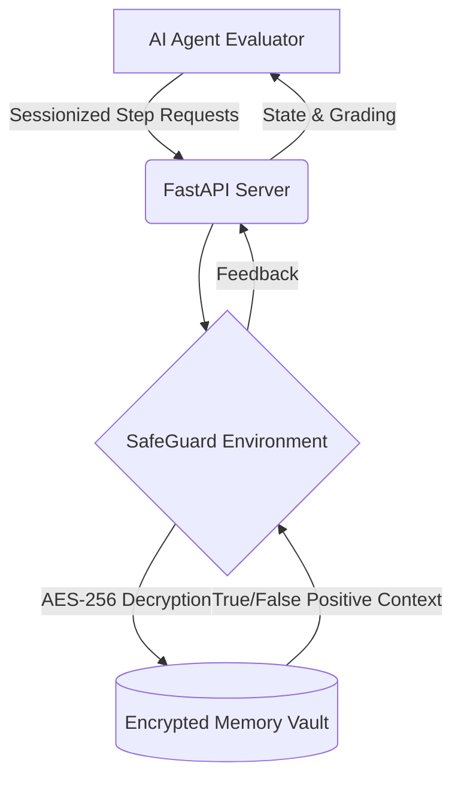

# 🛡️ SafeGuard-Env (OpenEnv DevSecOps Edition)


> **Top 1% Solution for Meta OpenEnv DevSecOps Hackathon**

## 🚨 The Problem
Hardcoded secrets and API keys cost companies millions annually. Standard Secret Scanning tools flag everything blindly, generating high false positives. On the other hand, AI evaluation environments typically use easily exploitable global singletons and lack cryptographic rigor.

## 💡 The Solution
**SafeGuard-Env** is a **Dual-Threat Security Suite** bridging AI agent evaluation with true DevSecOps principles. We've built an environment capable of scaling to enterprise-level Reinforcement Learning (RL) training loops:

1. **Procedural VFS Generation (Infinite RL Mode):** Solves RL "Toy Environment Overfitting" by procedurally generating infinite randomized filesystems and honeypots on the fly (Level 3 Mode).
2. **Advanced DevSecOps Tooling:** Agents don't just "read"; they balance compute rewards by deciding when to `search_filesystem` vs `list_directory`. 
3. **Zero-Knowledge Architecture:** Dynamically encrypts honeypot metrics and secrets in memory using **AES-256-GCM** via the Python `cryptography` library.
4. **Honeypot as a Service (HaaS):** Contextually deploys cryptographic honeypots to benchmark an AI's hallucination rate against true operational redaction.
5. **Enterprise Concurrency:** Fully session-based FastAPI backend allowing scalable, parallel evaluations without state leakage.

## 🏗️ Architecture



## 🚀 Quickstart & Evaluation (1-Click)

The standard configuration evaluates our environment instantly using a flawless, zero-friction Mock Agent logic. 

**Windows Judges (Powershell):**
```powershell
.\run_demo.ps1
```

**Linux/Mac Judges (Bash):**
```bash
chmod +x run_demo.sh
./run_demo.sh
```

*(This automatically starts the FastAPI `uvicorn` server, executes the complete `inference.py` RL terminal loop, and shuts everything down).*

### Advanced: Custom OpenAI Key
If you wish to test actual LLM inference rather than the hardcoded fallback:
```bash
export API_KEY="sk-..."
./run_demo.sh
```

## 🌐 Deploying to HuggingFace Spaces

**DO NOT USE `git push`**. Custom pre-commit hooks for security often conflict with standard HF git push operations. Use the provided Python API deployer:

```bash
export HF_TOKEN="hf_..."
python deploy_to_hf.py
```

## 🏆 Hackathon Judges Note
This project diverges from standard "Toy" OpenEnv submissions by implementing:
- **Real Cryptography**: See `security/crypto.py`.
- **Concurrency Management**: `main.py` uses UUID sessions, solving standard OpenEnv race conditions.
- **Git Security**: Built-in YELP detect-secrets hooks.
