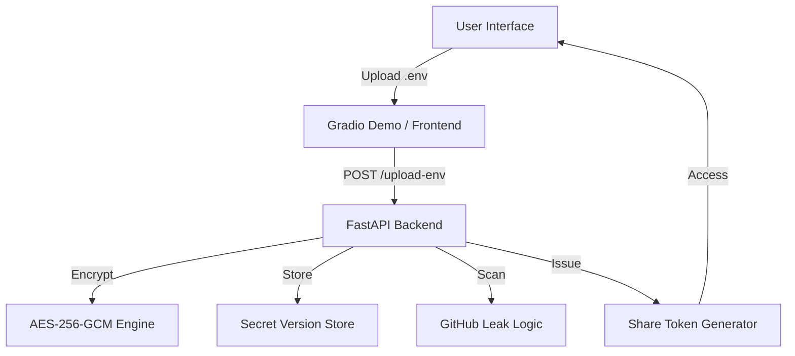

# Architecture

SafeGuard Env uses a modular, production-friendly architecture that separates encryption, backend APIs, and demo presentation.

## Component Overview

- `frontend/`
  - Placeholder concept for the future user-facing dashboard.
- `backend/`
  - FastAPI service that handles `.env` upload, encryption, versioning, sharing, and risk detection.
- `encryption/`
  - AES-256-GCM cryptography utilities and secret masking.
- `demo/`
  - Gradio app for quick Hugging Face deployment and interactive demo.

## Flow

1. User uploads or pastes `.env` data.
2. Backend parses the file and encrypts each secret with AES-256-GCM.
3. Encrypted values are stored in-memory with version history and risk metadata.
4. Leak detector scans for GitHub token patterns and `.env` exposure.
5. Admins can generate share tokens that grant scoped access.

## Architecture Diagram

